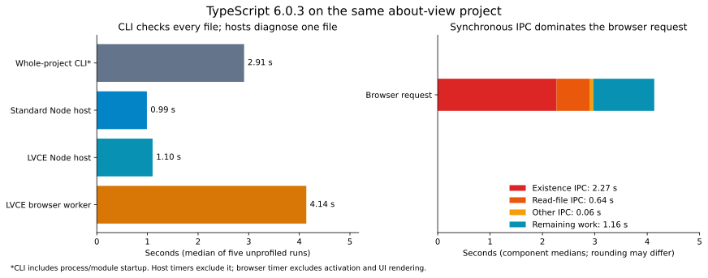

# TypeScript 6 CLI versus LVCE's TypeScript extension

TypeScript's compiler work is broadly comparable. The large difference is synchronous filesystem IPC: on the same CI runner, a cold diagnostic request takes **1.10 seconds through LVCE's host under Node**, versus **4.14 seconds in the browser extension**. **2.98 seconds of the browser request is spent in SyncApi calls**, mostly existence probes rather than reading file contents.

This compares the already optimized extension, including the request cache shipped in v5.28.1. It is not a comparison against the old uncached extension.

## Controlled measurements

[Successful experiment and raw artifacts](https://github.com/lvce-editor/performance-investigations/actions/runs/37232899720), [compact measured overview](typescript-cli-ci-overview.json), [CPU profile highlights](typescript-cli-cpu-hotspots.json).

- TypeScript **6.0.3**, Node **24.15.0**, Ubuntu 24.04 GitHub runner.
- Extension commit `4294e8a06bc4d4ba71490750e7b1670902a1d64d` (v5.28.1).
- About-view commit `db84fa6c54201e7ebb026be3d7aab3436785e9f5`, installed from its lockfile.
- Opened file: `packages/about-view/src/aboutWorkerMain.ts`.
- Config: `packages/about-view/tsconfig.json`, including both `src` and `test`. The root config only has project references: plain `tsc` at the root would not check this project.
- Five unprofiled fresh processes per Node mode, with alternating order. Five fresh servers and Chromium instances for the browser mode, with only the TypeScript extension enabled. CPU profiles were collected in separate runs.
- OS filesystem caches were left intact. Each CLI run uses a new incremental-state file. Cold means a fresh language service/browser, not a flushed disk cache.

| Workload | Median elapsed | What the timer includes |
| --- | ---: | --- |
| `node …/typescript/lib/tsc.js -p packages/about-view --noEmit --extendedDiagnostics` | **2.909 s** | Process startup and checking the whole project, including declarations |
| Standard TypeScript language-service host under Node | **0.989 s** | Config and program initialization, then semantic diagnostics for the opened file |
| Actual LVCE host/resolver under Node, direct filesystem adapter | **1.102 s** | The same single-file diagnostic operation, with LVCE's config discovery, host, resolver and request cache |
| Actual browser extension, real filesystem IPC | **4.138 s** | Cold worker diagnostic request; excludes extension activation, browser startup and displaying the trace |

The Node host timers exclude loading TypeScript and benchmark modules. Including process startup gives **1.295 s** for the standard host and **1.482 s** for LVCE's host. Comparing the CLI's 2.909 seconds directly with a diagnostic request would mix workloads and timing boundaries.

All modes report zero diagnostics. Both Node hosts have the same **145 root files** and **732 loaded source files**, with matching content hashes. The browser loads the same normalized file paths and byte sizes: **4,533,477 bytes** total. This rules out a substantially smaller source graph explaining the standard host's performance. Browser content hashes are not collected; its compiler libraries come from the same installed TypeScript package during the build.

The browser cold requests range from **4.062 to 4.354 seconds**. Immediately repeating the unchanged document takes a median **0.105 ms** inside the worker, with zero SyncApi calls. That demonstrates reuse; it does not measure edit latency or the time to update the editor UI.

## Where the difference comes from

| Filesystem operation | Node LVCE host: calls / median time | Browser: calls / median time |
| --- | ---: | ---: |
| Existence checks | 4,243 / **26.3 ms** | 4,213 / **2,267.6 ms** |
| Read file contents | 717 / **20.3 ms** | 717 / **640.2 ms** |
| Read directories | 98 / **1.8 ms** | 98 / **63.9 ms** |
| Bundled library reads | 88 / **13.0 ms** | Uses library cache/XHR; outside SyncApi totals |

The Node adapter has 30 additional failed existence attempts involving malformed `file://node_modules/…` fallback paths; its URL conversion throws, whereas the browser's negative results can be cached. The source graph and diagnostics still match. These are counts of underlying calls after the shipped request cache, not every compiler host invocation.

File-content reads are about **32 times slower** through the browser transport in this run, and existence checks about **86 times slower**. These ratios include transport, routing, waiting and instrumentation; they are not measurements of disk speed. A cheap Node existence check takes microseconds, so even roughly half a millisecond of IPC has a large relative cost. The anticipated 50% file-reading overhead substantially understates this workload's cost.

Subtracting each browser request's measured SyncApi duration leaves a median **1.163 s**, close to the direct Node LVCE request's **1.102 s**. The remainder includes compiler work, library access, bookkeeping and trace collection; it is not isolated compiler CPU. Nevertheless, it explains the observed slowdown without needing an unexplained multi-second compiler regression.

These measurements exclude ESLint contention. Earlier Electron startup profiles include concurrent workers and profiling overhead, so their larger TypeScript durations should not be substituted into this table.

## Compiler and CPU profile comparison

TypeScript's own performance measures in the unprofiled Node runs:

| Stage | Standard host | LVCE host |
| --- | ---: | ---: |
| Parse | 496 ms | 486 ms |
| Module resolution | 87 ms | 166 ms |
| Program construction | 713 ms | 829 ms |
| Bind | 227 ms | 221 ms |
| Check opened file | 13.33 ms | 13.18 ms |

Program construction includes parsing and resolution; these rows overlap and must not be added. LVCE's host adds about **11%** to the complete Node request here, primarily during resolution and program setup. Scanner, parser, binder and checker costs are similar.

The independent CPU profiles agree: `parseSourceFileWorker` has approximately **495 ms inclusive** in the standard host and **496 ms** in LVCE's host. Both profiles show the same scanner/JSDoc/binder functions and similar GC residency. The CLI instead has about **1.86 s inclusive** in `checkSourceFile`, because it checks every project source and declaration. Its unprofiled extended diagnostics report median parse **0.37 s**, bind **0.20 s**, check **1.84 s**, and compiler total **2.65 s**. CLI profiles include module startup; host profiles cover just the diagnostic operation.

The CLI bundles compiler code in `_tsc.js`; the language service uses `typescript.js`. Compare compiler operations rather than assuming their source locations or every internal call stack are identical. CPU profile figures are sample residency, including native waits, rather than OS CPU measurements.

## Further optimization opportunities

1. **Reduce synchronous round trips, particularly existence probes.** The existing cache already removed most repeated requests, but 4,213 existence calls still dominate this cold request. Prefetch a project/package file index or batch directory metadata before running synchronous compiler resolution. A worker-local snapshot can answer multiple probes without waiting once per path. Preserve provider identity, negative-result invalidation, package changes and filesystem changes between requests. Simply scheduling unrelated startup workers in parallel will not parallelize the synchronous calls inside this worker.
2. **Use a consistent identity for local paths.** The Node investigation finds 650 existence requests and 33 successful read requests where different strings normalize to an already queried physical path, such as `/workspace/package.json` and `file:///workspace/package.json`. The current cache keys the original string. Sharing these identities could eliminate roughly 683 calls on this checkout, about 13.5% of the Node transport count. This is a measured duplication opportunity, not a measured production speedup. A production implementation must handle escaping, Windows/UNC paths and remote providers correctly; blindly stripping `file://` would be unsafe.
3. **Bound fallback searches at the filesystem/URI root.** The legacy fallback currently walks above the root of file URIs and constructs paths such as `file://node_modules/url/package.json`. Those cannot name local files and cause failed work. Correctly stopping the search is a smaller opportunity than batching the thousands of valid probes.
4. **Keep compiler work proportional to the intended project.** The package config includes tests and their declaration dependencies even when opening a source file. Separate source/test configs may reduce the initial graph if appropriate for the project. Do not silently omit roots in the extension: global declarations and module augmentations can affect the opened file. The standard TypeScript host also loads this complete configured graph; this is not extra work unique to LVCE.

An experimental TypeScript `createModuleResolutionCache` with lifetime bounded to one synchronous turn preserved the graph but did **not** reduce the 5,058 underlying requests on this project. The existing filesystem request cache already handles that repetition. A possible CPU benefit needs an interleaved experiment; no production change was made on the strength of a single timing.

The immediate priority is filesystem metadata batching or a correctly invalidated worker snapshot. Rewriting the TypeScript checker, changing `skipLibCheck`, or adding more parallel startup workers is not supported as the main fix by these measurements. In particular, single-file diagnostics already spend only about 13 ms checking the opened file; the CLI's much longer whole-project check does not imply that this stage dominates extension startup.

## Reproduction

Use the repository's **TypeScript CLI and extension comparison** workflow. It pins both repositories and the Node version, checks source-graph equality, stores JSON summaries, logs and profiles, and retains artifacts for 90 days. The [scripts and local commands](../README.md) also support local runs.

No production extension code changed in this follow-up. The prior request-cache release remains the shipping optimization; this comparison identifies and quantifies the next opportunities.
